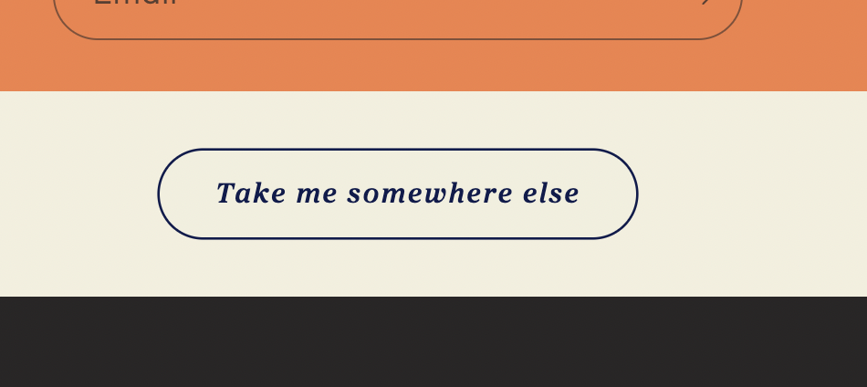

###### SHOPIFY PAGE URL PATH MANIPULATION
* code is optimized...
~ This only happens when:

```liquid
    
      
    
```
* See index.liquid file
* See full action [here](https://fritter.recipes/pages/goto-kenyan-recipes)

or at any page that has /page/goto-(slug) and look for this image



Ignore below instructions:
~ If you want to display a section, save it to the sections folder. Then you can you can render it like this:
```liquid 
     
```

~ However if you want to display a snippet, save it to the snippets folder. Then you can you can render it like this:
```liquid 
     
```

~ Assets like .css & .js files are stored inside the Assets folder